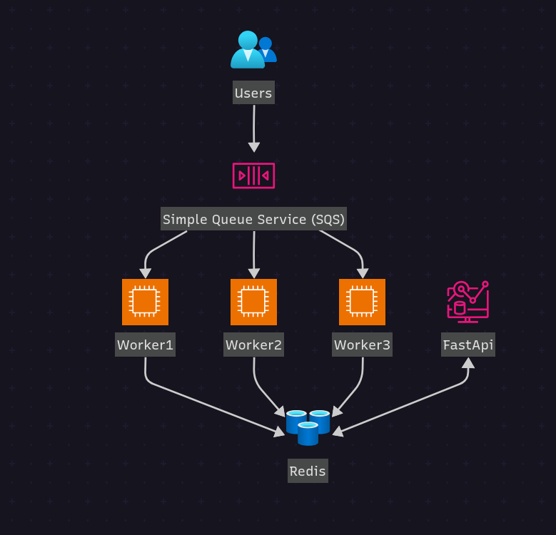

# Qyrus Assignment: E-Commerce Order Processing and Aggregation Pipeline

A production-ready data pipeline for processing e-commerce orders from AWS SQS, aggregating statistics in Redis, and exposing insights via a FastAPI REST API. This project demonstrates key data engineering skills including data ingestion, validation, caching, and API development.

## Architecture Overview



The pipeline consists of:
- **SQS Queue**: Receives order events from e-commerce platform
- **Worker Service**: Consumes messages, validates data, and updates Redis aggregates
- **Redis Cache**: Stores user-level and global order statistics
- **FastAPI API**: Provides REST endpoints for querying aggregated data

## Features

- **Data Ingestion**: Automated polling of SQS messages using LocalStack for local development
- **Data Validation**: Comprehensive order validation with automatic correction of value mismatches
- **Real-time Aggregation**: User and global statistics updated in Redis for fast retrieval
- **Scalable Design**: Multi-worker architecture with Docker containerization
- **REST API**: FastAPI-based endpoints for statistics queries
- **Local Development**: Complete Docker Compose setup with LocalStack and Redis

## Prerequisites

- Docker and Docker Compose
- Python 3.12+ (for local development)
- UV package manager (optional, for dependency management)

## Installation and Setup

### 1. Clone the Repository

```bash
git clone https://github.com/Ramachandra-2k96/qyrus-assignment
cd qyrus-assignment
```

### 2. Start Services with Docker Compose

```bash
docker-compose up --build
```

This will start:
- LocalStack (SQS simulation) on `http://localhost:4566`
- Redis on `localhost:6379`
- FastAPI API on `http://localhost:8000`
- Worker service (3 replicas) for message processing

### 3. Populate SQS with Sample Data

Run the population script to generate and send 100 sample orders:

```bash
uv run scripts/populate_sqs.py
```

Or using Python directly:

```bash
python scripts/populate_sqs.py
```

## Usage

### Verifying the Pipeline

1. **Check Service Health**:
   ```bash
   curl http://localhost:8000/health
   ```

2. **View Global Statistics**:
   ```bash
   curl http://localhost:8000/stats/global
   ```

3. **View User Statistics**:
   ```bash
   curl http://localhost:8000/users/{userID}/stats
   ```

### Monitoring Worker Processing

Check worker logs to see message processing:

```bash
docker-compose logs worker
```

## API Documentation

### Endpoints

#### GET `/`
Returns API information and available endpoints.

**Response:**
```json
{
  "message": "Welcome to Qyrus Assignment API",
  "version": "1.0.0",
  "docs": "/docs",
  "health": "/health"
}
```

#### GET `/health`
Health check endpoint that verifies Redis connectivity.

**Response:**
```json
{
  "status": "healthy",
  "services": {
    "redis": "connected",
    "api": "running"
  }
}
```

#### GET `/stats/global`
Retrieves global order statistics.

**Response:**
```json
{
  "total_orders": 100,
  "total_revenue": 15750.50
}
```

#### GET `/users/{user_id}/stats`
Retrieves statistics for a specific user.

**Parameters:**
- `user_id` (string): User identifier

**Response:**
```json
{
  "user_id": "U5678",
  "order_count": 25,
  "total_spend": 3200.75
}
```

### Interactive API Docs

Visit `http://localhost:8000/docs` for interactive Swagger UI documentation.

## Data Model

### Order Message Format
```json
{
  "order_id": "ORD1234",
  "user_id": "U5678",
  "order_timestamp": "2024-12-13T10:00:00Z",
  "order_value": 99.99,
  "items": [
    {
      "product_id": "P001",
      "quantity": 2,
      "price_per_unit": 20.00
    }
  ],
  "shipping_address": "123 Main St, Springfield",
  "payment_method": "CreditCard"
}
```

### Redis Data Structures

**User Statistics:**
- Key: `user:{user_id}`
- Fields: `order_count` (int), `total_spend` (float)

**Global Statistics:**
- Key: `global:stats`
- Fields: `total_orders` (int), `total_revenue` (float)

## Development

### Local Development Setup

1. Create virtual environment:
   ```bash
   python -m venv .venv
   source .venv/bin/activate  # On Windows: .venv\Scripts\activate
   ```

2. Install dependencies:
   ```bash
   uv sync
   ```

3. Run services individually:
   ```bash
   # Terminal 1: Start Redis
   docker run -p 6379:6379 redis:latest

   # Terminal 2: Start LocalStack
   docker run -p 4566:4566 -e SERVICES=sqs localstack/localstack

   # Terminal 3: Start API
   uv run uvicorn web.main:app --host 0.0.0.0 --port 8000

   # Terminal 4: Start Worker
   uv run python worker/worker.py
   ```
